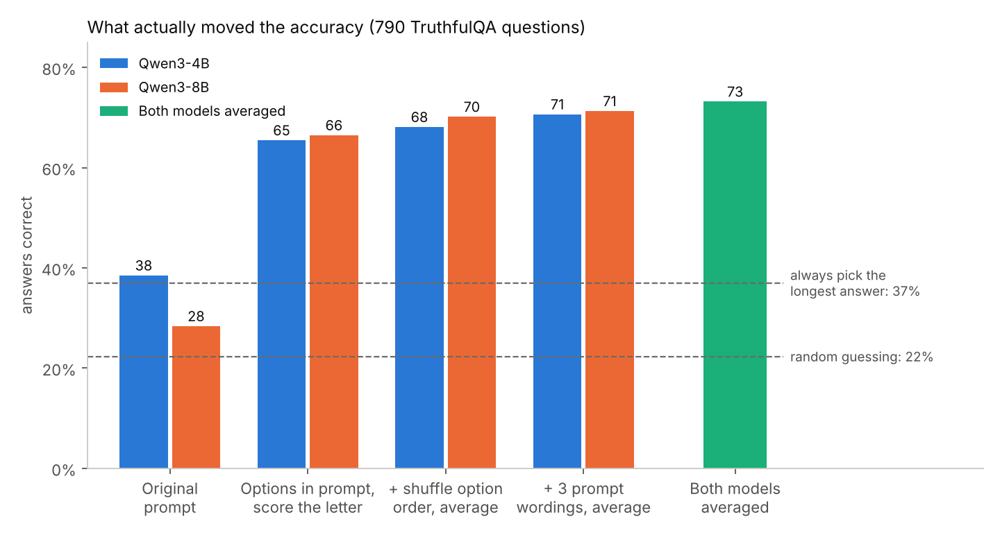
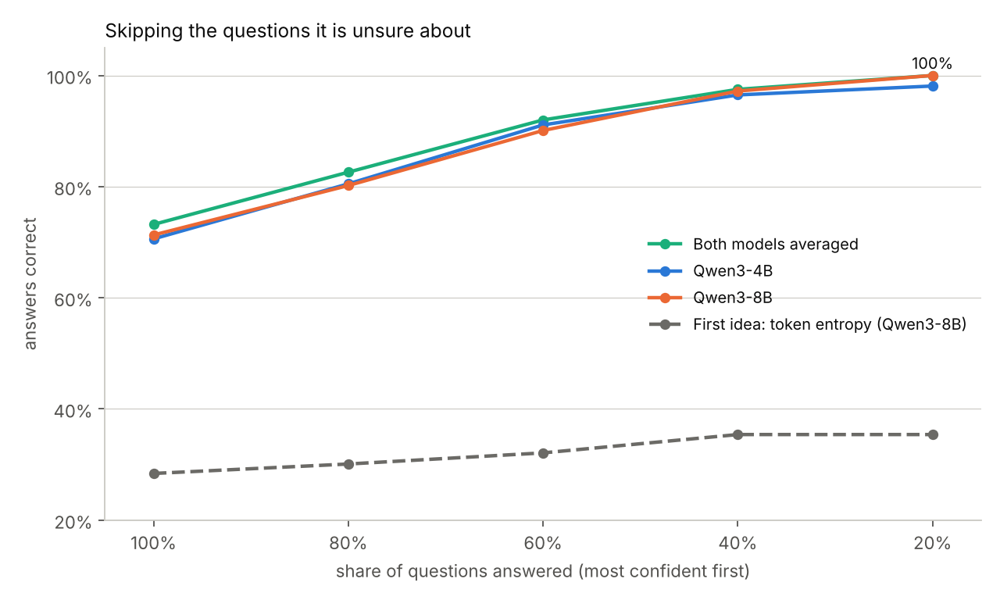
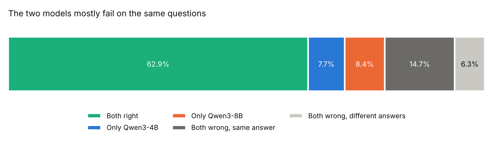

# Entropy as Hallucinogen, round 2

Round 1 started with a hunch: if a language model sounds unsure, it's probably wrong. I measured it, found almost nothing, and wrote that up. That repo is here: https://github.com/black-swas/Entropy-As-Hallucinogen

This is the sequel. I went back to see whether "almost nothing" was true, or whether I had just set up the test badly. Spoiler: a bit of both, and the second half is more interesting than the first.

## What was wrong with round 1

The baseline in round 1 was 25.6%. On this dataset, a coin-flip style random guess gets about 22%. So the model was barely beating a shrug, and I was then asking whether entropy could improve on a shrug.

Two things caused that:

- **The scoring was slightly off.** Each word of an answer was being compared with the model's prediction for the previous word. That is a bit like marking a student's essay against the neighbour's answer sheet.
- **The model only ever saw one answer at a time.** It was asked "how likely is this sentence?" with no idea what the other choices were. That mostly rewards short, common-sounding sentences, which is not the same as true ones.

The "oracle" at 40.8% also looked more impressive than it was. It counts a question as right if either of two guesses is right, and two random guesses already get about a third of the questions that way. So the gap to the oracle never proved there was a hidden signal. I read it that way at the time, and I shouldn't have.

I tried to re-run FLAN-T5 properly and couldn't get it to load correctly with the newer version of the library on Kaggle. So I switched to two newer models that fit on a free Kaggle T4 GPU: Qwen3-4B, and Qwen3-8B squeezed down to 4-bit so it fits in memory. Same 790 questions for both.

## What I changed

1. **Show every option in the prompt** and read which letter the model picks (A, B, C...), the way a person would take a multiple-choice exam.
2. **Shuffle the options and average over 6 different orders.** Models have favourite letters, a bit like a student who leans towards "C" when unsure.
3. **Ask the question 3 different ways** and average again. Basically asking the same person on three different days.
4. **Shuffle the answers once up front.** In the raw file the right answer is always listed first, so a model that just says "A" would score 100%. Easy to miss, and it would have produced a spectacular fake result.
5. **Add dumb controls.** Always pick the longest answer, always pick the shortest. If a trick that needs zero understanding scores well, I want to know before I get excited.

Then the original question, asked again: does the model's uncertainty tell us when it's wrong? I tried three kinds of uncertainty on the final answer (how confident it is, how spread out its answer is, how much the different prompts disagree) plus the token-entropy idea from round 1.

## What happened

| Step | Qwen3-4B | Qwen3-8B |
|---|---|---|
| Round 1 style prompt, score the answer text | 38.5% | 28.4% |
| Options in the prompt, read the letter | 65.4% | 66.5% |
| + average over option orders | 68.1% | 70.1% |
| + average over 3 prompt wordings | 70.6% | 71.3% |
| Both models averaged | 73.2% | |
| *Always pick the longest answer* | 37.0% | |
| *Random guessing* | 22.3% | |



Showing the model all the options was the big one, worth 27 to 38 points. The shuffling and re-wording added a few points each (the wording step on the 8B was within noise). Going from the 4B model to the 8B model hardly mattered.

One result made me laugh a bit. With the round 1 style prompt, the 8-billion-parameter model got 28.4%, which is *worse* than "always pick the longest answer" at 37%. A model with billions of parameters, beaten by a strategy a bored student would use. That is a good reminder of how much the way you ask matters.

Averaging the two models gave +1.9 points over the better one. That is small enough to be luck (p = 0.08), so I wouldn't bet on it.

### Does uncertainty tell you when it's wrong?

Yes, just not the kind I started with.

| Signal | Qwen3-4B | Qwen3-8B |
|---|---|---|
| How confident the final answer is | 0.86 | 0.86 |
| How spread out the final answer is | 0.85 | 0.85 |
| Disagreement between prompts | 0.85 | 0.84 |
| Token entropy (the round 1 idea) | 0.55 | 0.58 |

These are AUROC scores: 0.5 means no better than a coin flip, 1.0 means perfect.

After all the averaging, the model's confidence in its final answer is a very good warning light. If it is only allowed to answer the questions it is most sure about, accuracy shoots up:



- Answer everything: 73%
- Answer the 60% it's most sure of: 92%
- Answer the 40% it's most sure of: 97.5%
- Answer the 20% it's most sure of: 100%

The round 1 idea, token entropy, comes out barely better than a coin flip (0.55 to 0.58), which matches what I found the first time. The three better signals say nearly the same thing, so it is really one signal (how sure is the model about its final answer), not three.

### Learning to say "I don't know"

This is the part I actually find interesting. Knowing what you don't know is something people tend to think of as a human skill. The rest of us have all met someone who is confidently wrong. Here, a model that skips its 40% shakiest questions is right on 97.5% of the ones it answers. The skill isn't knowing more. It's noticing when to stay quiet.

### So why doesn't a bigger model, or two models, do much better?

They make the same mistakes.



Of the 21% of questions both models get wrong, they pick the same wrong answer 70% of the time. These are probably the common myths and misconceptions TruthfulQA is built around (the questions are designed to catch popular wrong beliefs). Both models read the same internet and picked up the same popular wrong idea. Averaging two copies of the same opinion doesn't fix it. Even if I could always pick the better model per question, the ceiling would be 79%.

Two models disagreeing was also a weaker warning sign (0.77) than one model's own confidence (0.86), so the second model barely helped there either.

## What I took from this

I went in expecting to confirm that entropy is useless. I came out with a more mixed view. Round 1 was right that entropy is a poor way to *choose* an answer, but the experiment was too broken to prove it. What the data supports is this: how you ask the question matters far more than anything to do with entropy (27+ points from showing the options), and once you average over a few re-orderings and re-wordings, the confidence of that averaged answer is a strong signal for when to hold back.

The round 1 hunch, "confident means right", was half true. It was just pointing at the wrong kind of confidence.

## Things that went wrong along the way

Because it's more honest than a tidy story:

- One early run showed entropy "helping by about 3 points". It came from a model that had loaded with scrambled word embeddings, so it was producing nonsense. That whole run got thrown out. The script now refuses to start if the model can't answer "capital of France?" sensibly.
- The safety check added to catch broken models was itself too strict, and it stopped perfectly good runs three times before I got the thresholds right.
- At one point the token entropy idea was graded against the wrong set of answers. Fixed, and that's why its number is in the table above and not an earlier, flattering one.
- Another early test had a "few-shot" version (giving the model a few solved examples first) that made things *worse*. I suspect that is partly how I formatted the examples, but I haven't tested that, so treat it as unresolved.

## Setup

- Models: Qwen3-4B-Instruct-2507 (fp16) and Qwen3-8B (4-bit), on a Kaggle T4 GPU
- Dataset: TruthfulQA multiple choice, 790 questions (some are dropped because they don't have exactly one right answer)
- Scoring: the model's probability for each answer letter, averaged over 6 option orders and 3 prompt wordings
- Speed: about 1 second per question for the 4B and 2 seconds for the 8B. Memory is cleared between models.

## Limitations

- One dataset, one shuffle of the answers, two models from the same family. The shared mistakes may partly be because they were trained alike.
- The 8B model is 4-bit compressed, which may cost it a little accuracy.
- I ran a lot of comparisons without correcting for that, so a p-value like 0.01 should be read as "probably real", not proof. The two big effects (showing the options, and the confidence-based warning) are far past that.
- Some of the "mistakes" might be the dataset's fault. A few TruthfulQA questions are debatable and I haven't gone through them by hand.
- FLAN-T5, the model from round 1, wasn't re-tested.
- Things I tried in the longer script that didn't help: subtracting the answer's baseline likelihood, a few solved examples in the prompt, combining signals with a fitted model, and a free-text version of semantic entropy. Details are in `extra/NOTES.md`.

## Reproduce it

On Kaggle (GPU T4, internet on):

```
!pip install -q "transformers>=4.51" accelerate bitsandbytes scipy
!python tqa_multi.py
```

That takes about 40 minutes for both models, most of it the 8B. Set `LIMIT = 100` at the top of `tqa_multi.py` for a quick test first. To try other models, edit the `MODELS` list at the top. Scores are saved as it goes, so a stopped run picks up where it left off.

## What's in this repo

- `tqa_multi.py`: the script that runs everything above
- `results/results.md`: the raw output of my Kaggle run, with confidence ranges (printed by an earlier version of the script, so a few row labels differ slightly; the numbers are the ones above)
- `results/results.json`: the headline numbers from the same run
- `images/`: the three charts
- `extra/`: the longer first attempt (`experiment_v2.py`, `combine_models.py`) and its notes, with all the things that didn't pan out
- Round 1 (FLAN-T5 and the original notebook) lives in the [first repo](https://github.com/black-swas/Entropy-As-Hallucinogen)

## License

Apache 2.0
